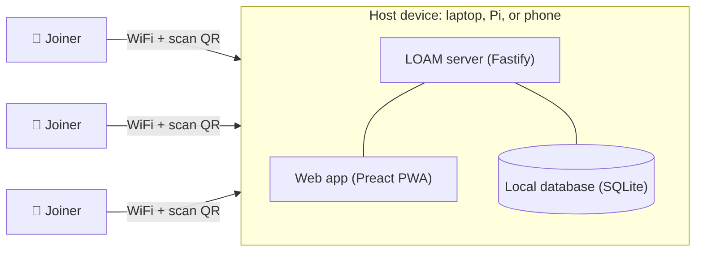
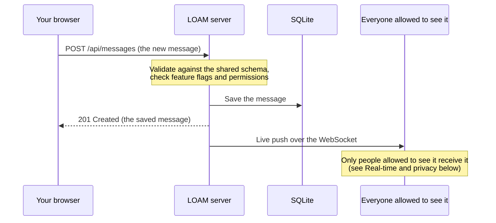
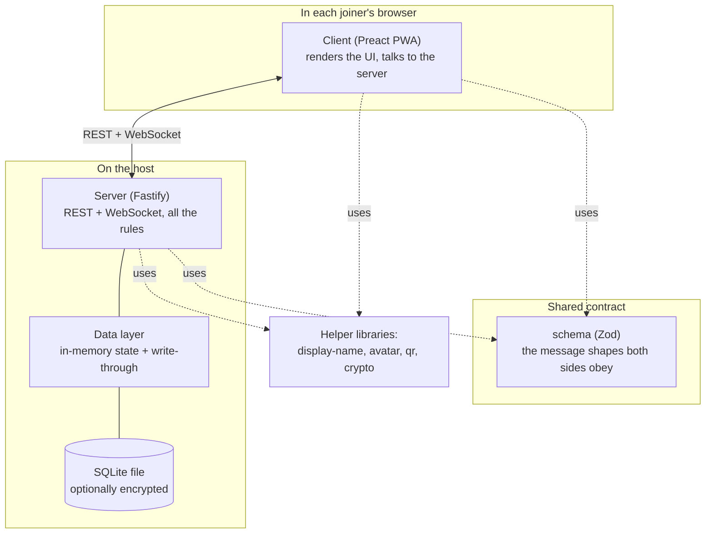
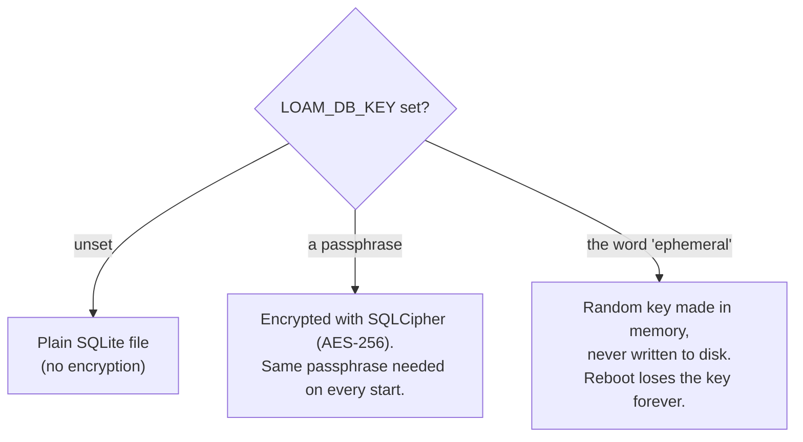
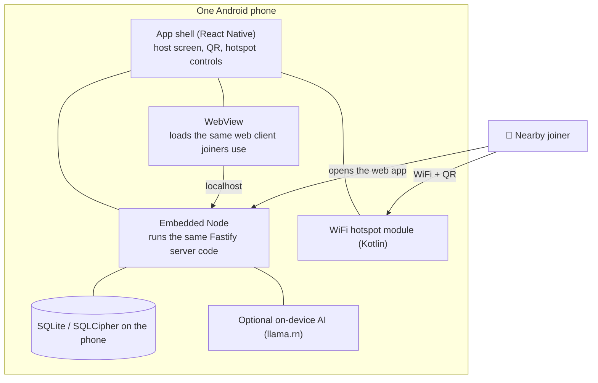
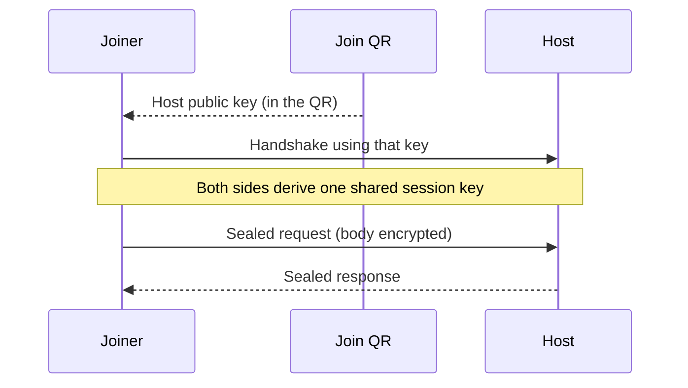
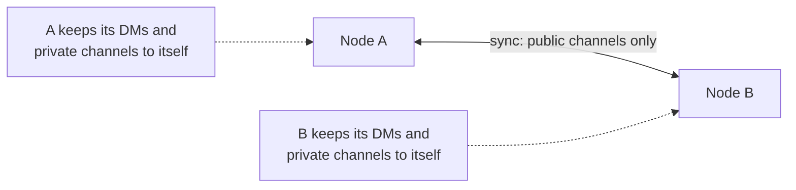
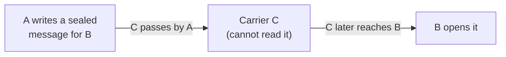

<p align="center">
  
</p>

<h1 align="center">LOAM</h1>

<p align="center">
  <strong>Off-grid, local-first messaging.</strong><br />
  Run it on a laptop, a Raspberry&nbsp;Pi, or your phone. Everyone nearby scans a QR code and starts talking. No internet, no accounts, no cloud.
</p>

<p align="center">
  <a href="https://loamnet.com">loamnet.com</a>
  ·
  <a href="#quick-start">Quick start</a>
  ·
  <a href="docs/roadmap.md">Docs</a>
</p>

<p align="center">
  <a href="https://github.com/JosephMaynard/loam/actions/workflows/ci.yml"></a>
  
  
  
</p>

---

## What LOAM is

*The name is a backronym: **L**ocal **O**ff-grid **A**d-hoc **M**essaging. (Yes, it is a type of soil, we picked the word first, and reverse-engineered the acronym afterwards. As one does.)*

LOAM is a messaging system that works **when the internet doesn't**. One person becomes the
*host*: they run LOAM on any device and turn it into a small WiFi hotspot. Everyone nearby scans a
QR code, the messaging app opens in their browser, and the group can post to channels, reply in
threads, send direct messages, react, and (if the host enables it) chat with a local AI, all over
the local network. Nothing leaves the immediate area and nothing touches a server you don't control.

It's built for the moments when normal networks are **unavailable, unreliable, or unsafe**:
emergencies and outages, large events and remote sites, and communities that simply want to talk
without an account, a data plan, or anyone in the middle.

LOAM's priorities, in order:

- **Simplicity**: no accounts, no installs, no setup. Scan and go.
- **Privacy**: identities are ephemeral and privacy-preserving by default, with no account required.
- **Resilience**: designed for very low bandwidth and intermittent connectivity.

It is **transport-agnostic**: WiFi today, with low-bandwidth radio relay (LoRa) a stated design
goal, so a message can eventually hop device-to-device across a wider area with the same experience.
An opportunistic store-and-forward relay (one device carrying a message toward another) is in early
development on the same transport-agnostic layer.

## Features

- 📡 **Off-grid by design**: a local hotspot is the whole network; no internet required at any point.
- 📱 **Nothing to install**: joiners open a link (or scan a QR); the host can run it from a laptop, Pi, or [an Android phone](docs/04-android-host-app.md).
- 🕶️ **Ephemeral, privacy-preserving identities**: every joiner gets a deterministic, memorable display name and avatar derived from a random id. No email, no phone number.
- 💬 **Real messaging**: public and private (invite-only) channels, threaded replies, direct messages, reactions, image attachments, and message search.
- 🕸️ **Node-to-node sync (optional)**: two LOAM nodes that can reach each other sync their public channels, so separate hotspots converge into one conversation ([docs/11](docs/11-node-sync.md)).
- 🤖 **Optional local AI**: point it at a laptop's [Ollama](https://ollama.com) model, or run a small downloadable model on the Android host itself (via llama.rn). Either way a bot appears as a DM contact and its replies stream in. Off by default, operator-installed, and entirely local.
- 🔌 **Works offline**: the client is an installable PWA that keeps working against its local cache when the connection drops.
- 🌍 **Minimal by design**: an intentionally sparse interface that stays out of the way and renders text in any language, including right-to-left scripts.
- 🌗 **Light & dark**: the client follows your system theme automatically.
- 🔒 **Optional encryption at rest + an Emergency Reset**: the host (desktop or Android) can encrypt the on-disk database and wipe everything in one action (see [Security](#security)).

## Quick start

### Install with npm (easiest)

If you just want to **run** a node, install the published package (Node ≥22 required; the default
database uses the built-in `node:sqlite`, so there's **no native build / no node-gyp**):

```bash
npm install -g loamnet     # the npm name is loamnet; the command is `loam`
loam                       # boots a node and prints a join QR + LAN URL
```

Scan the printed QR (or open the URL) from another device on the same network. That's the whole join
flow. Useful flags: `loam --port 8080`, `loam --data-dir ~/loam-data` (defaults to `$XDG_DATA_HOME/loam`
or `~/.loam`), and `loam --encrypt <passphrase>` to encrypt the database at rest (pulls an optional
native SQLCipher driver; skip it and storage stays plain). See [`loam --help`](docs/14-distribution.md).

### Develop from source (git clone)

For hacking on LOAM you'll want the repo. You'll need [Node 24.13.1](.node-version) and
[pnpm 10](https://pnpm.io) (`corepack enable` will set pnpm up for you).

```bash
pnpm install
pnpm dev
```

`pnpm dev` starts the server and client together and prints a **join QR code plus a LAN URL** to your
terminal. On any device connected to the same network, scan the QR or open the URL. That's the whole
join flow. (Under the hood the client runs on `:3000` and proxies the API to the server on `:3001`.)

### Run it as one process (production)

In production LOAM is a single origin: the client is built to static files and served by the server
with an SPA fallback.

```bash
pnpm build
pnpm --filter @loam/server start   # serves the built client + API, defaults to PORT 3000
```

The `loamnet` npm package above is exactly this single-origin build, bundled into one self-contained
file with the web client. See [docs/14-distribution.md](docs/14-distribution.md).

### Host it from an Android phone

`apps/app` is an Expo/React-Native host that runs the LOAM server **embedded on the phone**, brings
up a local-only WiFi hotspot, and shows the join QR, turning a single phone into a complete,
internet-free LOAM node.

**Prerequisites:** [Android Studio](https://developer.android.com/studio) (for its bundled JDK, the
Android SDK + platform-tools, and NDK r27+) with `adb` on your `PATH`. On macOS the build script
auto-detects the Studio JDK and SDK; otherwise set `JAVA_HOME` and `ANDROID_HOME` yourself.

**Build the APK** (one command from the repo root):

```bash
pnpm install
pnpm --filter app apk        # → apps/app/loam-host.apk (takes a few minutes)
```

That runs the whole pipeline (workspace build → native prebuild → bundle the embedded server → Expo
prebuild → `gradlew assembleRelease`) and writes the finished APK to `apps/app/loam-host.apk`.

**Copy it to a phone with `adb`:**

1. On the phone, enable **Developer options** (Settings → About phone → tap *Build number* 7×), then
   turn on **USB debugging**.
2. Connect the phone with a **data** USB cable (set it to *File transfer*) and accept the *Allow USB
   debugging?* prompt. Confirm the phone is listed:
   ```bash
   adb devices                # your phone's serial should appear
   ```
3. Install (and replace any older copy):
   ```bash
   adb install -r apps/app/loam-host.apk
   ```
   If both a phone and an emulator are connected, target the phone: `adb -s <serial> install -r apps/app/loam-host.apk`.
4. Launch **LOAM** on the phone. First cold start takes ~1 minute; tap **Share · Host** to bring up
   the hotspot and join QRs.

See **[docs/04-android-host-app.md](docs/04-android-host-app.md)** for the manual step-by-step, the
two-step join flow, and troubleshooting.

## How it works

At its simplest, LOAM has two sides: one **host** and any number of **joiners**.

The host is whoever runs LOAM (on a laptop, a Raspberry Pi, or a phone). That one device does three
jobs at once: it becomes a small WiFi hotspot, it runs the LOAM server, and it hands the messaging app
to anyone who connects. Joiners install nothing. They connect to the hotspot, scan a QR code, and the
app opens in their browser.



Everything lives on the host. Messages are stored on the host's disk, the app is served by the host,
and no data ever leaves the local network. Turn the host device off and the network is gone. There is
no internet, no cloud, and no accounts anywhere in the picture.

### What happens when you send a message

Sending a message is a short round trip. Your browser posts it to the server, the server checks it and
saves it, then the server pushes it out to everyone else over a live connection so it shows up on their
screens right away.



The **client** (the app in your browser) and the **server** never guess about each other. They share
one rulebook, a [Zod](https://zod.dev) schema package, and both check every message against it, so the
two sides can never drift out of shape. A "WebSocket" is just a two-way live connection that stays open,
so new messages arrive without the app having to keep asking.

## Project layout

A [pnpm workspace](pnpm-workspace.yaml) (`apps/*`, `packages/*`).

| Path | What it is |
|------|------------|
| [`apps/server`](apps/server) | Fastify backend: REST + WebSocket, SQLite persistence (optionally encrypted), optional Ollama LLM. |
| [`apps/client`](apps/client) | The Preact + Vite PWA everyone connects to. |
| [`apps/app`](apps/app) | Expo/React-Native Android host: runs the server on a phone and brings up a hotspot. |
| [`apps/site`](apps/site) | The [loamnet.com](https://loamnet.com) landing site (static Vite build). |
| [`packages/schema`](packages/schema) | The client↔server contract: shared Zod schemas + inferred types. |
| [`packages/display-name`](packages/display-name) | Deterministic, privacy-preserving display names from an id. |
| [`packages/avatar`](packages/avatar) | Deterministic SVG avatars from an id. |
| [`packages/qr`](packages/qr) | Dependency-free QR encoder + renderers used by the join flow. |

## Architecture in depth

This section goes deeper. You do not need any of it to run a node, but if you want to understand how
the pieces fit together, read on. Each part starts plain and then gets specific.

### The building blocks

Four kinds of thing make up LOAM: the app people use, the server that runs it, the shared rulebook the
two agree on, and a set of small helper libraries.



The **client** is a PWA, which is a website you can install like an app and that keeps working offline
against a local cache. The **server** is a single [Fastify](https://fastify.dev) process. The
**schema** package is the single source of truth for what a message, channel, or user looks like;
because both sides import it and validate against it, the wire format cannot drift. The **helper
libraries** are deliberately tiny and dependency-free: one turns an id into a memorable name, one turns
an id into an avatar, one draws QR codes, and one does the mesh cryptography.

### Identities and sessions

There are no accounts. The first time your browser talks to a node, the server mints a random id for
you (something like `user.1a2b3c4d`) and sets a cookie. That cookie is your identity for as long as you
keep it. Your display name and avatar are generated from the id and nothing else, so the same id always
looks the same to everyone, but there is no email, phone number, or password attached to it.

The names are deterministic and human-friendly: an `adjective.material.creature` triple (for example
`brave.copper.otter`) hashed from your id, so people can recognise each other across a session without
anyone signing up. The cookie is the real identity; the id your browser shows before the server answers
is just a placeholder that gets replaced on first load.

Who becomes the admin is a per-node choice the host makes: the first person to join, a one-time setup
code printed at startup, a shared passphrase, or nobody. Admin powers (moderation, config, the
Emergency Reset) are always checked on the server. The app only hides buttons; it never trusts the
browser.

### Storage: fast reads, safe writes

The server keeps the current state (users, channels, messages) in memory so reads are instant. Every
change is also written straight through to a SQLite file on disk before the server confirms it, so a
crash or restart loses nothing. There is no separate "save" step to forget.

The default database driver is Node's own built-in `node:sqlite`, which means there is no native
compiler step and no `node-gyp` to fight. When you turn on encryption (below), the server instead loads
an encrypted driver. Either way the code that reads and writes data is the same.

### Encryption at rest

A node can encrypt its on-disk database so a lost or seized host device does not readily give up stored
messages. It is off by default and picked with the `LOAM_DB_KEY` environment variable:



"At rest" means "while written to disk". Passphrase mode uses [SQLCipher](https://www.zetetic.net/sqlcipher/)
so the file on flash is ciphertext. Ephemeral mode keeps the key only in memory, so the data is readable
while the process runs and gone the moment it stops. The same encrypted driver ships with the Android
host, so this is available on a phone and not only on a desktop.

### Real-time and privacy: who sees what

New messages travel over the WebSocket. The server does not blindly send everything to everyone. Before
each live update goes out, it checks the audience:

- **Public channel** posts go to everyone.
- **Direct messages** and reactions on them go only to the two participants.
- **Private channels** are fully hidden from non-members: the channel, its messages, and reactions on
  them are only sent to members. Someone removed from a private channel gets a targeted event that
  purges it from their device.

Optional **presence** shows small online dots next to who is currently connected. It can be turned off
for high-risk settings, because it reveals who is present.

### Feature flags and security profiles

Almost everything is a switch the host can flip: replies, direct messages, reactions, public channels,
private channels, markdown, attachments, presence, the local AI, node-to-node sync, and the mesh. These
switches are enforced on the server, so turning something off actually stops it, rather than only hiding
a button.

For convenience, a named **security profile** bundles a coherent set of these switches:

| Profile | What it aims for |
|---------|------------------|
| `open` | easiest to join, fewest restrictions |
| `standard` | a sensible middle ground |
| `hardened` | join approval, disappearing messages, Emergency Reset armed, transport encryption required |
| `custom` | you set every switch yourself (the default) |

Picking a named profile forces its bundle of settings; `custom` leaves every switch under your own
control.

### Running on a phone: the Android host

The Android host (`apps/app`) is the most involved piece, because it packs a whole node into one app.
It runs the **real LOAM server embedded on the phone** using a mobile build of Node, brings up a
local-only WiFi hotspot, and shows the messaging app in a WebView (an in-app browser view). To the
joiners it looks exactly like any other LOAM node.



Because the embedded server is the same code as the desktop server, features behave the same way. The
phone-specific parts are the hotspot, the WebView, the encrypted-database key handoff (the app holds the
key in the phone's secure keystore and hands it to the embedded server at boot), and the optional
on-device AI. Building this app is a one-command step; see [Host it from an Android
phone](#host-it-from-an-android-phone) above and [docs/04](docs/04-android-host-app.md).

### Transport encryption for hostile networks

The traffic between a joiner and the host normally runs as plain HTTP over the LAN, which is fine on a
trusted network. For untrusted networks LOAM can add an app-layer encryption on top, bootstrapped from
the join QR so there is nothing to type. Browsers block the usual web crypto on a plain-HTTP LAN
address, so LOAM ships its own: an X25519 key handshake and XChaCha20-Poly1305 sealing (the same modern
primitives used elsewhere, in a small pure library).



It has three levels: `off` (plain HTTP, the default), `optional` (encrypt the contents but leave paths
visible), and `required` (also route every request through one opaque tunnel, so even which page you
asked for is hidden). In `required` mode the only thing visible on the wire is that "a request happened"
plus its rough size and timing. Reading the host public key from the QR (rather than trusting whatever
the network offers) is what makes this resistant to a machine-in-the-middle on the LAN. This is an
emerging feature; see [docs/08](docs/08-transport-security.md).

### Connecting separate nodes: sync and mesh

Two hotspots do not have to stay separate. LOAM has two ways to join up conversations, for two
different situations.

**Node-to-node sync** is for nodes that *can* reach each other, even briefly (same larger network, or
one within radio range of another). They gossip their **public** data only, pulling each other's public
channel messages so the two hotspots converge into one conversation. Direct messages, private channels,
and anything from a blocked author never leave a node. A peer's join URL is also its sync address.



**Opportunistic mesh** (a delay-tolerant "carry my message" relay) is for when two people *cannot* reach
each other directly, but a third person moves between them. Person A seals a message so only person B can
open it, and a carrier C physically carries the sealed blob from A's area to B's, without ever being able
to read it.



The sealing uses per-user mesh identities and a self-certifying address, so a carrier cannot read the
message and a swapped key is rejected. It is delivered by relaying sealed blobs with limits on how far
and how long they travel. This is a phased, security-first effort; the cryptography and addressing are
built and tested, while the device-to-device radio transport is still in progress. See
[docs/16](docs/16-opportunistic-mesh.md).

### The Emergency Reset

The host can wipe a node in one action. It deletes stored messages, avatars, and sessions, tells every
connected client to purge its local copy and show a neutral disconnected screen, and re-seeds a clean
node. The node configuration survives, so it comes back ready to use. In encrypted-at-rest mode the
wipe also rotates the key, so remnants left on flash become unreadable rather than merely deleted. An
optional pre-shared token can trigger it without logging in. It is called `killSwitch` in the code and
"Emergency Reset" in the app; see [docs/02](docs/02-kill-switch.md).

### Optional on-device AI

The local AI is off by default and entirely local when on. On a desktop it points at a model you run in
[Ollama](https://ollama.com). On the Android host it can instead download and run a small model on the
phone itself (through llama.rn). Either way a bot shows up as a direct-message contact and its reply
streams in token by token. On the phone, loading a multi-gigabyte model is carefully bounded so a slow
or stuck load can never freeze the assistant, and switching or deleting a model cleans up its memory
safely. See [docs/06](docs/06-llm.md).

## Configuration

LOAM runs with **no config file at all**. Optional identity and LLM features are enabled by creating
`.loam/config.json` (or pointing `LOAM_CONFIG_FILE` at another JSON path). See
[`config.example.json`](config.example.json) for the full set. A minimal example, assuming
[Ollama](https://ollama.com) is running locally:

```json
{
  "identity": {
    "allowUserDisplayNameEdit": true,
    "allowUserAvatarEdit": true,
    "allowUserAvatarUpload": true
  },
  "llm": {
    "ollama": {
      "enabled": true,
      "baseUrl": "http://localhost:11434",
      "model": "gemma4",
      "botId": "llm.ollama.gemma4",
      "botDisplayName": "Gemma"
    }
  }
}
```

When the LLM is enabled the bot appears as a DM contact and its replies stream into the conversation.
With `allowUserAvatarUpload` on, users can pick an image, crop it **locally in the browser**, and
upload only the final 256×256 avatar; the original file never leaves the device. If the config is
absent, none of these features are active. The AI assistant can also run on the Android host as a
small downloadable on-device model instead of a laptop's Ollama; either path is optional and local.

## Security

LOAM can **encrypt its on-disk database** so that a lost or seized host device doesn't readily give
up stored messages. It's **off by default** and controlled by the `LOAM_DB_KEY` environment variable:

- **unset**: no encryption; the database is a plain SQLite file.
- **a passphrase**: encrypted at rest with SQLCipher (AES-256); the same passphrase is required on every start.
- **`ephemeral`**: a random key is generated in memory and **never written to disk**. Data is readable only while the process runs; a reboot loses the key forever, and an Emergency Reset ([kill switch](docs/02-kill-switch.md)) rotates to a fresh key so anything still physically on flash becomes unreadable.

```bash
LOAM_DB_KEY=ephemeral pnpm --filter @loam/server start
```

The SQLCipher driver ships with the Android host too, so encryption at rest is available there and
not only on desktop. It stays off by default on every platform.

For untrusted networks there is also an **optional app-layer transport encryption** (an X25519
handshake bootstrapped from the join QR, off by default) that seals request and WebSocket traffic on
top of plain HTTP on the LAN. It is an emerging feature: see [docs/08](docs/08-transport-security.md).

**Honest limitations.** This raises the bar; it is not a guarantee of safety. The host processes
messages in plaintext while running, so a compromised host, a device seized while powered on with the
key in memory, or coercion of a known passphrase can still expose data. Anyone whose safety depends
on this should seek a professional security review and not treat LOAM as sufficient on its own. See
[`SECURITY.md`](SECURITY.md) and the [docs](#documentation) for the full threat model.

> **A note on intent.** These protections exist to protect *ordinary people*: during emergencies, in
> communities cut off from connectivity, and in everyday situations where privacy and safety matter. They
> are deliberately **not** marketed as a way to hide wrongdoing, and LOAM's other design choices (a
> trusted host who can read and wipe everything, admin moderation) reflect that.

## Documentation

Design notes, threat models, and initiative briefings live in [`docs/`](docs/):

- [Roadmap & how the initiatives interlock](docs/roadmap.md)
- [SQLite migration](docs/01-sqlite-migration.md) · [Kill switch](docs/02-kill-switch.md) · [Admin UI](docs/03-admin-ui.md)
- [Android host app](docs/04-android-host-app.md) · [Authentication](docs/05-authentication.md) · [LLM](docs/06-llm.md)
- [More features menu](docs/07-more-features.md) · [Transport security](docs/08-transport-security.md) · [Security profiles](docs/09-security-profiles.md)
- [Maps & location sharing](docs/10-maps-location-sharing.md) · [Node-to-node sync](docs/11-node-sync.md)
- [Operator's guide: running a node](docs/12-operators-guide.md) · [Internationalization](docs/13-i18n.md)
- [Distribution: the `loamnet` npm package](docs/14-distribution.md)
- [`CLAUDE.md`](CLAUDE.md): architecture baseline for contributors (and AI agents).

## Contributing

```bash
pnpm install    # install workspace deps
pnpm dev        # run server + client, print the join QR
pnpm build      # build every package, then server and client (also type-checks via tsc)
pnpm test       # run the workspace test suite
```

CI runs `pnpm build` then `pnpm test` on every push and PR to `master`. There's no separate lint or
typecheck script; type-checking happens as part of `pnpm build`. If you're new to the codebase,
[`CLAUDE.md`](CLAUDE.md) is the fastest way in, and a server or client test harness is a
high-value first contribution.

## License

LOAM is licensed under the **[GNU Affero General Public License v3.0](LICENSE)**. Copyright ©
Magic Zebra Ltd. The AGPL's network-use clause means that if you run a modified LOAM as a service,
you must offer your users the corresponding source.
