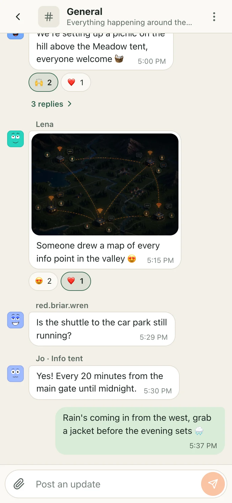
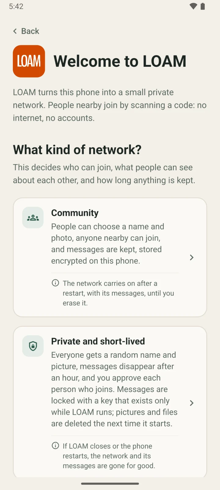
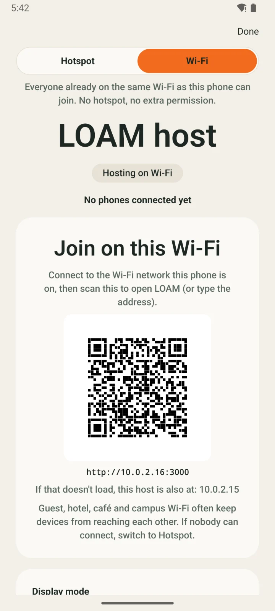
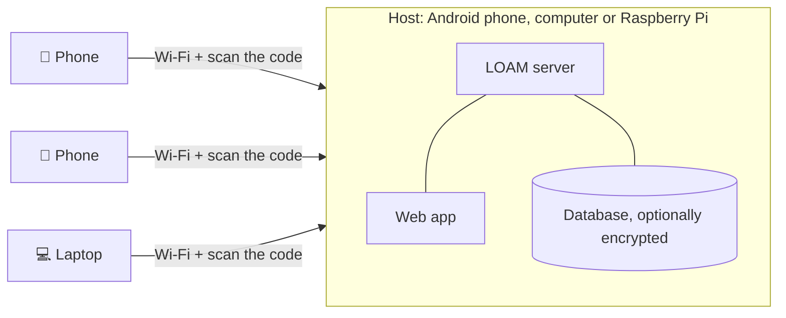

<p align="center">
  
</p>

<h1 align="center">LOAM</h1>

<p align="center">
  <strong>Messaging for the people around you. No internet needed.</strong><br />
  Start a network on an Android phone, a laptop or a Raspberry&nbsp;Pi. People nearby scan a code and
  start talking: no accounts, no cloud, nothing to install.
</p>

<p align="center">
  <a href="https://loamnet.com">loamnet.com</a>
  ·
  <a href="#start-a-network">Start a network</a>
  ·
  <a href="docs/12-operators-guide.md">Operator's guide</a>
  ·
  <a href="#documentation">Docs</a>
</p>

<p align="center">
  <a href="https://github.com/MagicZebraLtd/loam/actions/workflows/ci.yml"></a>
  
  <a href="https://www.npmjs.com/package/loamnet"></a>
</p>

<p align="center">
  <picture>
    <source srcset="apps/site/public/shots/phone-general-dark.webp" media="(prefers-color-scheme: dark)" />
    
  </picture>
  &nbsp;
  <picture>
    <source srcset="apps/site/public/shots/android-setup-type-dark.webp" media="(prefers-color-scheme: dark)" />
    
  </picture>
  &nbsp;
  <picture>
    <source srcset="apps/site/public/shots/android-share-wifi-dark.webp" media="(prefers-color-scheme: dark)" />
    
  </picture>
</p>

---

## What LOAM is

LOAM is local communication for places where the internet is missing, overloaded or not the right
tool: an outage, an emergency, a festival, a campsite, a community space. One device becomes the
**host** and runs the network. Everyone nearby scans its code, LOAM opens in their browser, and they
can post in channels, reply in threads, send direct messages, share pictures and react. Everything
stays on the host and on the phones of the people using it, plus any other LOAM network the host links
to, which receives the public channels.

Its priorities, in order: **simplicity** (scan and go), **privacy** (no accounts, nothing collected)
and **resilience** (low bandwidth, connections that come and go).

*The name is a backronym: **L**ocal **O**ff-grid **A**d-hoc **M**essaging. (Yes, it's also a type of
soil. We picked the word first and worked out the letters afterwards.)*

## Start a network

### On an Android phone

1. **Download [`loam-host.apk`](https://github.com/MagicZebraLtd/loam/releases/latest/download/loam-host.apk)**
   from the [latest release](https://github.com/MagicZebraLtd/loam/releases/latest) and open it to
   install. Your phone may ask you to allow installs from your browser.
2. **Answer four questions:** your language, the kind of network (see [below](#kinds-of-network)),
   its name, and how people connect: **Hotspot** (the phone makes its own Wi-Fi, no router needed) or
   **Wi-Fi** (everyone on the Wi-Fi the phone is already on).
3. **Show the code.** The share screen shows what people scan. **Display mode** puts it full screen,
   keeps the screen on and pins LOAM in front, for a phone left where people can see it.

The host phone is the network's admin automatically. Needs Android 7 or newer; hosting a hotspot needs
Android 8 or newer.

### On a Mac, Linux or Windows computer, or a Raspberry Pi

```bash
npx loamnet
```

It opens LOAM's terminal screen, with the QR code to scan (see below). Needs
[Node.js](https://nodejs.org) 22.14 or newer.

```bash
npx loamnet --port 8080            # another port (by default 3000, or the next free one)
npx loamnet --data-dir ~/loam      # where to keep the data (default ~/.loam)
npx loamnet --encrypt              # encrypt the database (asks for a passphrase); pictures and
                                   # files are stored beside it, unencrypted
npx loamnet --kiosk                # start locked, showing only the join QR
npx loamnet --plain                # print the QR and addresses instead (also what a service gets)
npm install -g loamnet && loam     # install it for good
```

#### The terminal screen

In a terminal, `loamnet` takes over the window (your scrollback comes back when it stops) and keeps the
join code on screen. Everything else is a number key away, and **?** lists the keys:

| Key | Screen | What it's for |
|---|---|---|
| **1** | Join | The QR code and the address. **o** opens LOAM in your browser as the network's admin (**p** then shows a QR that makes a phone admin), **a** picks which network address to advertise, **h** hides the code. |
| **2** | Activity | Requests and problems as they happen. **e** shows only problems, space pauses. |
| **3** | People | Who has joined and who is online. **m** makes someone an admin. |
| **4** | Settings | The network's name, security profile, who can join, encryption and how long messages last, changed live; a code to link another network; Emergency Reset; and the port and kiosk mode for next time. |
| **5** | Debug | Versions, how the node is set up, recent problems, detailed logging, and a diagnostics file for a bug report. |

Messages, approvals and moderation stay in the web app. Nobody becomes admin just by opening a new
network first: admin comes from this screen.

**Kiosk mode** (**k**, or start with `--kiosk`) locks the terminal to the join code, the network's name
and the number of connected devices until a password is entered, so a computer can be left on a desk
for people to join from. It locks the screen, not the computer.

Run as a service, or with `--plain`, `loamnet` prints the address and the QR code instead.

More in the [`loamnet` README](cli/README.md).

### Joining

Any phone, tablet or computer joins from its browser, iPhones included: connect to the same Wi-Fi or
hotspot, scan the code, and LOAM opens. There is nothing to install and no account to make. The code
also carries the network's encryption key, so messages to and from the host are encrypted from the start.

## What you can do

- **Channels, threads and direct messages.** Public channels, private ones by invitation, threaded
  replies, one-to-one messages, reactions, pictures and files, and search.
- **No sign-up.** Everyone gets a generated name and picture, or picks their own if the network allows
  it. No email, no phone number.
- **Moderation.** Approve newcomers, appoint moderators and greeters, handle reports, ban, time out or
  shadow-ban. Anyone can block someone they'd rather not hear from.
- **Invite codes.** On a network that approves newcomers, the host phone's code lets people straight in.
  It changes every 10 minutes, so an old photo of it stops working.
- **Link networks.** Two LOAM networks can share their public channels both ways. The existing network
  shows a single-use link code; the other phone scans it during setup. Direct messages and private
  channels never leave either network. (Mesh mail, experimental and off by default, can travel through
  linked networks, sealed so that only its recipient's network can open it.)
- **Emergency reset.** Press and hold to erase the whole network at once, on the host and on every phone
  connected to it.
- **Fifteen languages,** left to right and right to left: English, Español, Français, العربية, فارسی,
  Português, Українська, Русский, Türkçe, မြန်မာ, اردو, دری, پښتو, Kiswahili and বাংলা.
- **Copes with a bad signal.** Phones keep what they've already seen and reconnect on their own.
- **An assistant, if you want one.** A small AI model on the host phone, or a laptop's
  [Ollama](https://ollama.com) model, answering in direct messages. Still no internet, and off unless
  you turn it on.

## Kinds of network

The Android app's setup offers three. Everything can be changed later in the admin area.

| | Who can join | Names | Messages | Stored on the host |
|---|---|---|---|---|
| **Community** | anyone nearby | people choose a name and photo | kept until erased | encrypted, survives a restart |
| **Private and short-lived** | each person approved first | random names and pictures | disappear after an hour (by default) | encrypted under a key that exists only while LOAM runs |
| **Choose every setting myself** | your choice | your choice | your choice | encrypted unless you turn it off |

A Private network also only accepts encrypted connections and doesn't show who is online. On a
computer, the same settings live in the admin area as **security profiles**
([docs/09](docs/09-security-profiles.md)).

## Privacy and security

- **Nothing to collect.** No accounts, no analytics, no advertising, no crash reporting. Messages stay
  on the host and on the phones that received them. That also means LOAM never tells us when something
  goes wrong, so if you find a problem, please
  [open an issue](https://github.com/MagicZebraLtd/loam/issues) or email Magic Zebra Ltd at
  magicaltrailsapp@gmail.com.
- **Encrypted connections.** Joining by the code sets up an encrypted connection to the host (an X25519
  handshake and XChaCha20-Poly1305), so nobody else on the Wi-Fi can read the messages. By default,
  pictures and files are downloaded unencrypted, so someone on the same Wi-Fi could see them; a network
  that requires encryption (the Private one does) encrypts those too, and refuses anyone who didn't join
  by the code ([docs/08](docs/08-transport-security.md)).
- **Encrypted storage.** The host can keep its database encrypted with SQLCipher, under a key held in
  the phone's keystore, a passphrase, or a key that lives only in memory. An encrypted setting never
  falls back to storing data unencrypted. Pictures and files are stored beside the database, not
  encrypted; an Emergency reset deletes them.
- **Emergency reset.** Erases every message, person, picture and file, and tells connected phones to
  clear their copy. On the Android app, and on a computer using a key that lives only in memory, the key
  is replaced too, so what's left on the storage can't be read ([docs/02](docs/02-kill-switch.md)).

**Know the limits.** The host can read every message: it's the server. A host device taken while it's
running, with the key in memory, can give up what it holds. LOAM raises the bar; it isn't a guarantee.
If your safety depends on it, get a professional review first. [`SECURITY.md`](SECURITY.md) has the full
threat model, and every network serves its own privacy policy at `/privacy` (also on
[loamnet.com](https://loamnet.com/privacy)).

## How it works

The host runs everything: the LOAM server (Node.js, Fastify), its database (SQLite) and the web app it
hands to each phone that connects. Phones talk to it over the local network; nothing goes anywhere
else. Switch the host off and the network is gone.


```mermaid
flowchart LR
    P1["📱 Phone"] -->|"Wi-Fi + scan the code"| Host
    P2["📱 Phone"] -->|"Wi-Fi + scan the code"| Host
    P3["💻 Laptop"] -->|"Wi-Fi + scan the code"| Host
    subgraph Host["Host: Android phone, computer or Raspberry Pi"]
        direction TB
        S["LOAM server"] --- C["Web app"]
        S --- DB[("Database, optionally encrypted")]
    end
```

The Android app packs a whole host into one phone: it runs the same server on an embedded Node.js,
raises a local-only hotspot, and shows the web app in its own screen. The browser app is a Preact PWA
that keeps a local copy of what it has seen and reconnects by itself. Client and server share one set
of [Zod](https://zod.dev) schemas, so the two can't drift apart.

Linked networks pull each other's **public** content ([docs/11](docs/11-node-sync.md)). An experimental opportunistic mesh,
where a third person's phone carries a sealed message between two people who can't reach each other,
is built on the server but not yet verified on real radios ([docs/16](docs/16-opportunistic-mesh.md)).

## Development

You'll need [Node.js 24.15.0](.node-version) and [pnpm 10](https://pnpm.io) (`corepack enable` sets pnpm
up).

```bash
pnpm install
pnpm dev        # server + web app together, and a join QR in the terminal
pnpm build      # every package, the server and the web app (type-checks as it goes)
pnpm test       # the whole test suite
```

In development the web app runs on `:3000` and proxies the API to the server on `:3001`. In production
they're one process: `pnpm build && pnpm --filter @loam/server start`, which is what the `loamnet`
package bundles.

**The Android app** needs [Android Studio](https://developer.android.com/studio) (its JDK, the Android
SDK and NDK r27 or newer) and `adb` on your `PATH`:

```bash
pnpm --filter app apk                   # → apps/app/loam-host.apk (a few minutes)
adb install -r apps/app/loam-host.apk   # onto a phone with USB debugging on
pnpm --filter app typecheck             # its own type-check (CI runs it too)
```

Without a release key (`pnpm --filter app keystore`) the APK is signed with your machine's debug key,
and the build says so. A debug-signed APK can't update a release-signed install.
[docs/04](docs/04-android-host-app.md) covers the app in depth.

| Path | What it is |
|---|---|
| [`apps/server`](apps/server) | The server: REST and WebSocket, SQLite (optionally SQLCipher), sync, mesh, assistant. |
| [`apps/client`](apps/client) | The web app everyone uses (Preact, Vite). |
| [`apps/app`](apps/app) | The Android host app (Expo, React Native, embedded Node.js). |
| [`apps/site`](apps/site) | [loamnet.com](https://loamnet.com). |
| [`cli`](cli) | The `loamnet` npm package. |
| [`packages/*`](packages) | The shared schemas, names, avatars, QR codes and crypto. |

[`CLAUDE.md`](CLAUDE.md) is the fastest way into the codebase, for people and AI agents alike. CI checks
that every package version agrees, then builds, tests, type-checks the Android app and smoke-tests the
packed CLI on every push and pull request to `master`.

## Documentation

- [Operator's guide](docs/12-operators-guide.md): running a network, from setup to emergency.
- [Android host app](docs/04-android-host-app.md) · [The `loamnet` package](docs/14-distribution.md)
- [Transport security](docs/08-transport-security.md) · [Security profiles](docs/09-security-profiles.md)
  · [Emergency reset](docs/02-kill-switch.md) · [`SECURITY.md`](SECURITY.md)
- [Linking networks](docs/11-node-sync.md) · [Opportunistic mesh](docs/16-opportunistic-mesh.md)
- [Languages](docs/13-i18n.md) · [The assistant](docs/06-llm.md)
- [Mission](MISSION.md) · [Acceptable use](ACCEPTABLE_USE.md) · [Roadmap](docs/roadmap.md)

## License

LOAM is licensed under the [GNU Affero General Public License v3.0](LICENSE). Copyright © Magic Zebra
Ltd. If you run a modified LOAM as a service, the AGPL asks you to offer its users the source.
